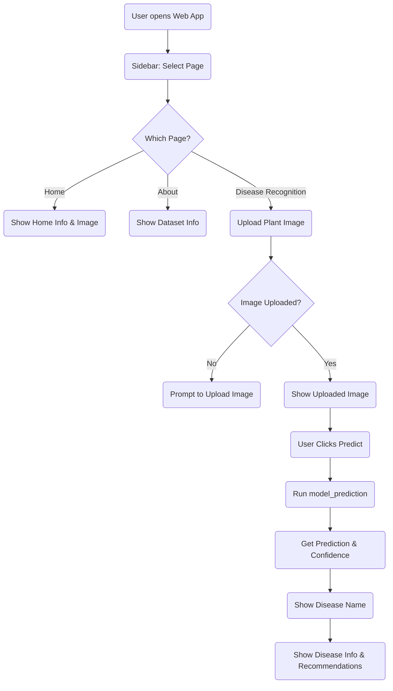

- Hi, I’m @Raza-abidi
- I’m interested in machine learning and blockchain technology
- I’m currently working on machine learning and deep learning
- I’m looking to collaborate on anything realted to web3, AI, ML
<!---
Raza-husain/Raza-husain is a ✨ special ✨ repository because its `README.md` (this file) appears on your GitHub profile.
You can click the Preview link to take a look at your changes.
--->

